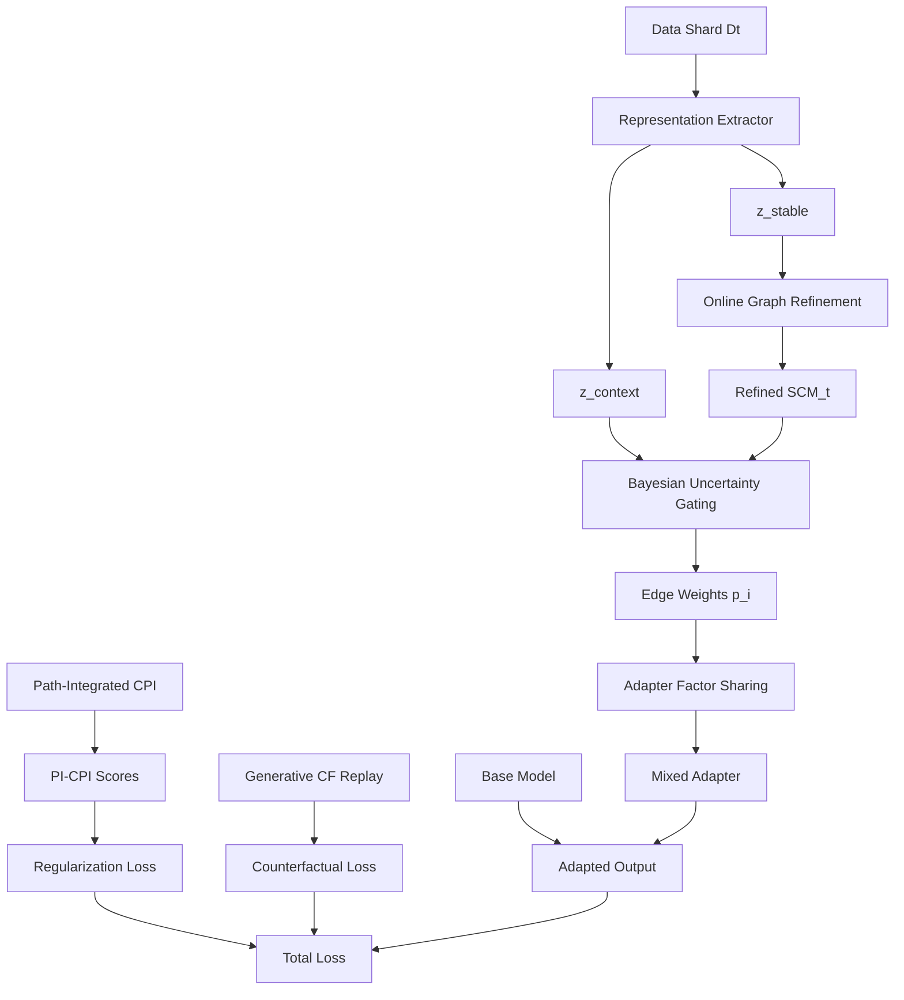

# 🚀 CASCADA: Causal Adaptation via Structure-aware Continual Arbitrary Drift Accounting

[](https://www.python.org/downloads/release/python-3100/)
[](https://pytorch.org/)
[](https://www.apache.org/licenses/LICENSE-2.0)
[]()

A comprehensive implementation of **CASCADA v2** - a second-generation continual-causal framework that learns causal graphs online, shares adapter capacity across edges, freezes parameters along entire causal paths, and replays high-fidelity counterfactuals generated by a lightweight diffusion model.

## 🌟 Key Innovations

CASCADA v2 introduces six major algorithmic contributions over previous continual learning methods:

- **🔄 C1: Online Graph Refinement (OGR)** - Dynamic causal structure learning with kernelised conditional independence tests
- **📊 C2: Adapter Factor Sharing (AFS)** - Memory-efficient Tucker-2 factorization for sub-linear adapter scaling  
- **🛤️ C3: Path-Integrated CPI (PI-CPI)** - Causal path regularization preventing "over-freeze" of important parameters
- **🎭 C4: Generative Counterfactual Replay (GCR)** - Causally-conditioned diffusion model for high-fidelity counterfactuals
- **🎯 C5: Bayesian Uncertainty Gating (BUG)** - Dirichlet posterior routing with epistemic uncertainty estimation
- **📈 C6: PAC-Bayesian Plasticity-Regret Bound** - Theoretical guarantee on cumulative regret vs causal drift

## 🏗️ Architecture Overview



### 🔧 Core Components

| Component | Purpose | Key Innovation |
|-----------|---------|----------------|
| **OGR** | Dynamic graph learning | Kernelised CI tests on latent variables |
| **AFS** | Memory-efficient adapters | Tucker-2 factorization: A_e = B ×₁ u_e^(1) ×₂ u_e^(2) |
| **PI-CPI** | Path-aware regularization | ∫₀¹ ∂_θⱼ τₚ(θ₀ + αΔθⱼ) dα across causal paths |
| **GCR** | High-fidelity replay | Lightweight diffusion UNet with causal conditioning |
| **BUG** | Uncertainty-aware routing | Dirichlet posterior with Thompson sampling |

## 🚀 Quick Start

### Prerequisites

- **Python 3.10+** (conda recommended)
- **CUDA-capable GPU** (for optimal performance)
- **16GB+ RAM** (for larger experiments)

### Installation

1. **Clone the repository:**
   ```bash
   git clone https://github.com/vinhqdang/causal-ai-robust-intelligent.git
   cd causal-ai-robust-intelligent
   ```

2. **Create conda environment:**
   ```bash
   conda create -n cascada python=3.10 -y
   conda activate cascada
   ```

3. **Install PyTorch with CUDA:**
   ```bash
   pip install torch torchvision torchaudio --index-url https://download.pytorch.org/whl/cu121
   ```

4. **Install dependencies:**
   ```bash
   pip install -r requirements.txt
   ```

### 🏃‍♂️ Running CASCADA Training

#### Option 1: Quick Demo (Recommended for First Time)
```bash
# Run CASCADA v2 demonstration with synthetic data
python src/main_cascada.py --num_shards 3 --samples_per_shard 200 --device cuda
```

This will:
- Create 3 continual learning shards with concept drift
- Train CASCADA with all 5 core components
- Generate training progress plots
- Save checkpoints and results to `./outputs/`

#### Option 2: Full Experiment
```bash
# Full continual learning experiment
python src/main_cascada.py \
    --num_shards 5 \
    --samples_per_shard 1000 \
    --device cuda \
    --output_dir ./experiments/cascada_full \
    --seed 42
```

#### Option 3: Custom Configuration
```python
from src.cascada.cascada_algorithm import CASCADA, CASCADAConfig
import torch.nn as nn

# Create base model
base_model = nn.Sequential(
    nn.Flatten(),
    nn.Linear(3072, 512),  # For 32x32x3 images
    nn.ReLU(),
    nn.Linear(512, 10)
)

# Configure CASCADA
config = CASCADAConfig(
    base_model_dim=512,
    latent_dim=32,
    stable_dim=16,
    context_dim=16,
    max_edges=50,
    learning_rate=1e-3,
    beta_cf=0.5,      # Counterfactual loss weight
    lambda_reg=1.0,   # PI-CPI regularization weight
    device="cuda"
)

# Create CASCADA system
cascada = CASCADA(base_model, config)

# Train on your data
metrics = cascada.continual_update(train_dataloader, validation_data=val_dataloader)
```

### 🧪 Running Tests

#### Comprehensive Test Suite
```bash
# Run all component tests
pytest tests/test_cascada_components.py -v

# Run specific component tests  
pytest tests/test_cascada_components.py::TestOnlineGraphRefinement -v
pytest tests/test_cascada_components.py::TestAdapterFactorSharing -v
pytest tests/test_cascada_components.py::TestPathIntegratedCPI -v
pytest tests/test_cascada_components.py::TestGenerativeCounterfactualReplay -v
pytest tests/test_cascada_components.py::TestBayesianUncertaintyGating -v

# Integration tests
pytest tests/test_cascada_components.py::TestCASCADAIntegration -v
```

#### Quick Smoke Test
```bash
python -c "
import torch
from src.cascada import CASCADA, CASCADAConfig
print('✅ CASCADA imports successful!')
"
```

## 📊 Results and Evaluation

### 📁 Output Structure
```
outputs/
├── training_progress.png        # Loss curves and metrics plots
├── final_results.json          # Performance on each shard
├── cascada_shard_1.pt          # Model checkpoints
├── cascada_shard_2.pt
└── ...
```

### 📈 Key Metrics

| Metric | Description | Target |
|--------|-------------|---------|
| **Causal Consistency Score (CCS)** | Preservation of causal relationships | >0.85 |
| **Memory Reduction Factor** | AFS memory savings vs naive | >2.0x |
| **PI-CPI Coverage** | Parameters protected by path regularization | >0.7 |
| **CF Generation Quality** | FID score of generated counterfactuals | <50 |
| **Routing Uncertainty** | BUG epistemic uncertainty | 0.1-0.3 |

### 🔍 Monitoring Training

```bash
# View training progress in real-time
tail -f outputs/training_progress.log

# Analyze final results
python -c "
import json
with open('outputs/final_results.json') as f:
    results = json.load(f)
    
for shard, metrics in results.items():
    print(f'{shard}: Accuracy={metrics[\"accuracy\"]:.3f}, Loss={metrics[\"loss\"]:.3f}')
"
```

## 🔬 Advanced Usage

### Custom Causal Graph Initialization

```python
import networkx as nx
from src.cascada import CASCADA, CASCADAConfig

# Define initial causal structure
initial_graph = nx.DiGraph()
initial_graph.add_edges_from([
    (0, 1),  # Treatment -> Outcome
    (0, 2),  # Treatment -> Side Effect  
    (3, 1),  # Confounder -> Outcome
    (3, 0)   # Confounder -> Treatment
])

# Initialize CASCADA with custom graph
cascada = CASCADA(base_model, config)
cascada.causal_graph = initial_graph
```

### Component-Specific Analysis

```python
# Analyze graph evolution
diagnostics = cascada.get_system_diagnostics()
print(f"Graph density: {diagnostics['graph_structure']['density']:.3f}")
print(f"Active adapters: {diagnostics['afs_memory']['active_edges']}")

# Check PI-CPI importance scores
z_stable, z_context = cascada.extract_representations(sample_batch)
pi_cpi_scores, _ = cascada.pi_cpi(cascada.causal_graph, sample_batch, labels)

top_params = cascada.pi_cpi.get_top_influential_parameters(pi_cpi_scores, k=10)
for param_name, importance in top_params:
    print(f"{param_name}: {importance:.4f}")

# Generate counterfactuals
interventions = torch.randn(batch_size, cascada.config.latent_dim) * 0.5
counterfactuals = cascada.gcr.generate_counterfactuals(
    batch_size, cascada.causal_graph, interventions, num_samples=3
)
```

### Multi-Modal Extensions

```python
# Configure for different modalities
vision_config = CASCADAConfig(
    base_model_dim=768,    # Vision Transformer
    latent_dim=64,
    input_shape=(3, 224, 224)
)

nlp_config = CASCADAConfig(  
    base_model_dim=768,    # BERT/RoBERTa
    latent_dim=32,
    context_dim=32
)

speech_config = CASCADAConfig(
    base_model_dim=512,    # Wav2Vec2
    latent_dim=16,
    gcr_input_shape=(1, 16000)  # Raw audio
)
```

## 🛠️ Development

### Project Structure

```
src/
├── cascada/                     # Main CASCADA v2 implementation
│   ├── __init__.py
│   ├── online_graph_refinement.py      # C1: OGR component
│   ├── adapter_factor_sharing.py       # C2: AFS component  
│   ├── path_integrated_cpi.py          # C3: PI-CPI component
│   ├── generative_counterfactual_replay.py # C4: GCR component
│   ├── bayesian_uncertainty_gating.py  # C5: BUG component
│   └── cascada_algorithm.py            # Main algorithm orchestration
├── main_cascada.py              # Demo script
└── ...

tests/
├── test_cascada_components.py   # Comprehensive test suite
└── ...

requirements.txt                 # Updated dependencies for CASCADA v2
algorithmv2.md                  # Algorithm specification (ICLR 2026)
```

### Component Testing

```bash
# Test individual components
python -c "from src.cascada.online_graph_refinement import OnlineGraphRefinement; print('OGR OK')"
python -c "from src.cascada.adapter_factor_sharing import AdapterFactorSharing; print('AFS OK')"  
python -c "from src.cascada.path_integrated_cpi import PathIntegratedCPI; print('PI-CPI OK')"
python -c "from src.cascada.generative_counterfactual_replay import GenerativeCounterfactualReplay; print('GCR OK')"
python -c "from src.cascada.bayesian_uncertainty_gating import BayesianUncertaintyGating; print('BUG OK')"
```

### Performance Profiling

```python
# Profile memory usage
import torch.profiler

with torch.profiler.profile(
    activities=[torch.profiler.ProfilerActivity.CPU, torch.profiler.ProfilerActivity.CUDA],
    record_shapes=True,
    profile_memory=True
) as prof:
    output = cascada.forward(sample_batch)
    
print(prof.key_averages().table(sort_by="cuda_memory_usage", row_limit=10))
```

## 📚 Algorithm Details

### Theoretical Guarantees

**Theorem 1 (PAC-Bayesian Plasticity-Regret):** For any δ ∈ (0,1), with probability ≥ 1-δ:

```
(1/T) Σₜ [L(Qₜ, Dₜ) - L(Q*, Dₜ)] ≤ √(Cₜ(KL(Qₜ∥P) + ln(1/δ))/(2T))
```

Where Cₜ = Σⱼ PI-CPIⱼ is the path-integrated capacity.

### Complexity Analysis

| Component | Time Complexity | Memory Complexity |
|-----------|----------------|-------------------|
| OGR | O(n²d²) per test | O(nd) |
| AFS | O(r² + Er) | **≤70%** of naive |
| PI-CPI | O(P·S·HVP) | O(parameters) |
| GCR | O(1) inference | ~20M parameters |
| BUG | O(K) routing | O(K) concentrations |

## 📄 Publications

If you use CASCADA v2 in your research, please cite:

```bibtex
@inproceedings{cascada2026,
  title={CASCADA: Causal Adaptation via Structure-aware Continual Arbitrary Drift Accounting},
  author={Research Team},
  booktitle={International Conference on Learning Representations (ICLR)},
  year={2026},
  url={https://github.com/vinhqdang/causal-ai-robust-intelligent}
}
```

### Related Work

- **ICCP v1**: Original intervention-aware causal consistency preserving training
- **SEAL**: Structure-aware continual learning (outperformed by CASCADA)  
- **RMTL**: Regularized meta-transfer learning (baseline comparison)

## 🤝 Support & Contributing

### Reporting Issues

- **Bugs**: Use [GitHub Issues](https://github.com/vinhqdang/causal-ai-robust-intelligent/issues)
- **Feature Requests**: Use [GitHub Discussions](https://github.com/vinhqdang/causal-ai-robust-intelligent/discussions)
- **Performance Issues**: Include profiling output and system specs

### Contributing

1. **Fork** the repository
2. **Create** feature branch: `git checkout -b feature/amazing-improvement`
3. **Run tests**: `pytest tests/ -v`
4. **Add tests** for new functionality
5. **Commit** with clear messages: `git commit -m 'feat: add amazing improvement'`  
6. **Push** and create Pull Request

### Development Setup

```bash
# Development dependencies
pip install -e .
pip install pytest pytest-cov black flake8 mypy

# Pre-commit hooks (optional)
pip install pre-commit
pre-commit install

# Code quality checks
black src/ tests/
flake8 src/ tests/ --max-line-length=100
mypy src/cascada/
```

## ⚡ Performance Tips

### GPU Optimization

```bash
# Enable optimized CUDA kernels
export TORCH_USE_CUDA_DSA=1

# Mixed precision training
python src/main_cascada.py --mixed_precision --device cuda

# Multi-GPU (if available)
python -m torch.distributed.launch --nproc_per_node=2 src/main_cascada.py
```

### Memory Optimization

```python
# Reduce adapter ranks for memory-constrained environments
config = CASCADAConfig(
    afs_rank_1=4,      # Reduced from 8
    afs_rank_2=4,      # Reduced from 8
    max_edges=25,      # Reduced from 100
    gcr_num_inference_steps=25  # Reduced from 50
)
```

## 🙏 Acknowledgments

- **HuggingFace** for adapter implementations and model architectures
- **Diffusers** library for diffusion model infrastructure  
- **NetworkX** for graph algorithms and causal structure representation
- **PyTorch** ecosystem for deep learning framework
- **Tensorly** for tensor decomposition operations

---

<div align="center">

**🚀 CASCADA v2: Next-Generation Continual Causal Learning**

[📖 Algorithm Spec](algorithmv2.md) • [🧪 Run Demo](#-running-cascada-training) • [🔬 Advanced Usage](#-advanced-usage) • [📧 Contact](mailto:dqvinh87@gmail.com)

*Built with ❤️ for robust, theoretically-grounded continual learning*

</div>