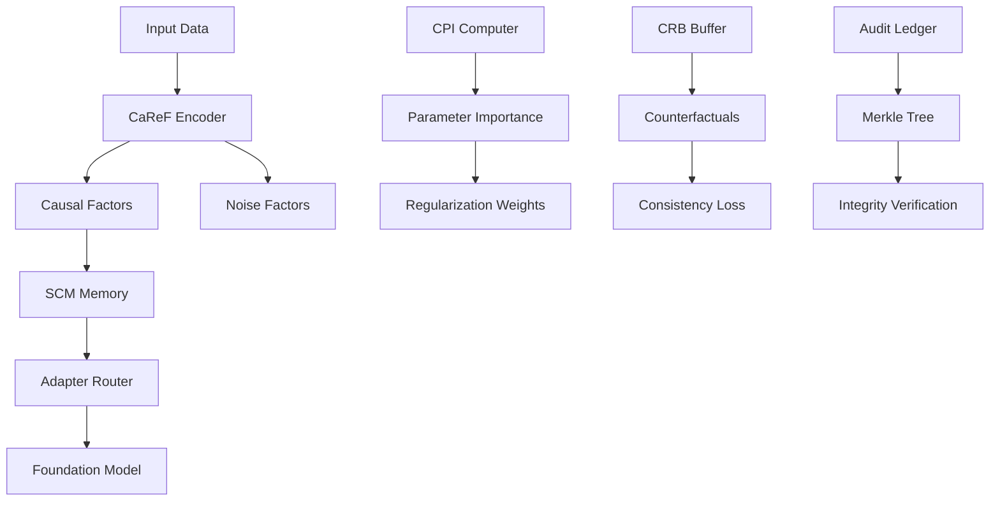

# 🚀 ICCP: Intervention-aware Causal Consistency Preserving Training

[](https://github.com/vinhqdang/causal-ai-robust-intelligent/actions)
[](https://www.python.org/downloads/release/python-380/)
[](https://www.gnu.org/licenses/gpl-3.0)
[](https://pytorch.org/)

A comprehensive implementation of the **Intervention-aware Causal Consistency Preserving (ICCP)** algorithm for robust and auditable continual learning in foundation models.

## 🌟 Overview

ICCP addresses the critical challenge of **model rot** in foundation models by treating each update as a causal intervention, preserving learned causal mechanisms while adapting to new data. Our implementation provides a complete, production-ready framework with:

- 🧠 **Advanced causal representation learning** with mutual information constraints
- 🔗 **Adaptive structural causal memory** using efficient LoRA adapters
- 📊 **Influence function-based parameter importance** with Fisher approximation
- 🔄 **Counterfactual replay buffers** for causal consistency
- 🔐 **Cryptographic audit ledger** with SHA-256 chaining and Merkle trees
- 📈 **Comprehensive evaluation metrics** for causal reasoning assessment

## 🏗️ Architecture



### 🔧 Core Components

| Component | Purpose | Key Features |
|-----------|---------|--------------|
| **CaReF Encoder** | Causal feature extraction | MINE loss, d-separation constraints, freezing |
| **SCM Memory** | Structural adaptation | LoRA adapters, cosine gating, metadata tracking |
| **CPI Computer** | Parameter importance | Fisher approximation, influence functions |
| **CRB Buffer** | Counterfactual replay | Parent-stat encoding, differentiable sampling |
| **Audit Ledger** | Transparency & trust | SHA-256 chains, Merkle batching |

## 🚀 Quick Start

### Prerequisites

- **Python 3.8+** (3.9+ recommended)
- **CUDA-capable GPU** (optional, but recommended)
- **Conda** environment manager

### Installation

1. **Clone the repository:**
   ```bash
   git clone https://github.com/vinhqdang/causal-ai-robust-intelligent.git
   cd causal-ai-robust-intelligent
   ```

2. **Create conda environment:**
   ```bash
   conda create -n iccp python=3.9
   conda activate iccp
   ```

3. **Install dependencies:**
   ```bash
   pip install -r requirements.txt
   ```

### 🏃‍♂️ Running ICCP Training

#### Option 1: Full Training (Recommended)
```bash
# Run complete ICCP training with all components
python -m src.main
```

This will:
- Initialize all ICCP components (CaReF, SCM-Mem, CPI, CRB, Audit)
- Train for 10 epochs with synthetic causal data
- Generate comprehensive evaluation metrics
- Save results to `artefacts/results/`
- Create audit logs in `artefacts/`

#### Option 2: Component Testing
```bash
# Test individual components
python -m src.caref.encoder          # CaReF encoder with MINE loss
python -m src.adapters.scaffolding   # SCM memory with LoRA adapters
python -m src.influence_functions.ops # CPI with Fisher approximation
python -m src.crb.buffer            # Counterfactual replay buffer
python -m src.audit                 # Cryptographic audit ledger
python -m src.evaluation.metrics    # Comprehensive evaluation metrics
```

#### Option 3: Custom Configuration
```python
from src.main import ICCPTrainer, ICCPTrainingConfig

# Create custom configuration
config = ICCPTrainingConfig()
config.num_epochs = 5
config.batch_size = 16
config.causal_dim = 256
config.lambda_cf = 1.0  # Increase counterfactual loss weight

# Run training
trainer = ICCPTrainer(config)
results = trainer.train()
eval_results = trainer.evaluate()
```

### 🧪 Running Tests

#### Comprehensive Test Suite
```bash
# Run all tests with coverage
pytest tests/test_smoke.py -v --tb=short

# Run specific component tests
pytest tests/test_smoke.py::TestCaReFEncoder -v
pytest tests/test_smoke.py::TestSCMMemory -v
pytest tests/test_smoke.py::TestCPIComputer -v
pytest tests/test_smoke.py::TestCRBBuffer -v
pytest tests/test_smoke.py::TestAuditLedger -v
```

#### Individual Component Tests
```bash
# Quick smoke test
python tests/test_smoke.py

# Test with mocked dependencies (faster)
python -c "
from tests.test_smoke import test_smoke
test_smoke()
print('✅ All tests passed!')
"
```

## 📊 Results and Evaluation

After training, ICCP generates comprehensive results:

### 📁 Output Structure
```
artefacts/
├── results/
│   ├── training_metrics.json      # Loss curves, gradient norms
│   └── evaluation_results.json    # Causal consistency scores
├── ledger.jsonl                   # Audit trail (append-only)
├── hash_chain.json               # Integrity checksums
└── merkle_roots.json             # Batch verification hashes
```

### 📈 Key Metrics

| Metric | Description | Target Range |
|--------|-------------|--------------|
| **Causal Consistency Score** | Preservation of causal relationships | 0.8+ |
| **FATE Score** | Forgetting-adjusted treatment effects | <0.2 |
| **Disentanglement Score** | Separation of causal vs noise factors | <0.1 |
| **Counterfactual Validity** | Quality of generated counterfactuals | 0.7+ |
| **Parameter Importance Coherence** | CPI-gradient correlation | 0.6+ |

### 🔍 Monitoring Training

```bash
# View real-time training progress
tail -f artefacts/ledger.jsonl

# Analyze results
python -c "
import json
with open('artefacts/results/evaluation_results.json') as f:
    results = json.load(f)
print(f'Final Causal Consistency: {results[\"eval_causal_consistency_mean\"]:.4f}')
print(f'Audit Integrity: {results[\"audit_integrity\"][\"valid\"]}')
"
```

## 🔬 Advanced Usage

### Custom Causal Graphs

```python
# Define your causal structure
config = ICCPTrainingConfig()
config.causal_edges = [
    "user_context->treatment",
    "treatment->outcome", 
    "user_context->outcome",
    "treatment->side_effects"
]

trainer = ICCPTrainer(config)
```

### Intervention Analysis

```python
# Analyze causal interventions
from src.crb.buffer import CounterfactualReplayBuffer

crb = trainer.crb_buffer
cf_data = crb.sample_counterfactuals("treatment->outcome", batch_size=100)
original, counterfactual, _ = cf_data

print(f"Average Treatment Effect: {(counterfactual - original).mean():.4f}")
```

### Audit Verification

```python
# Verify audit integrity
integrity = trainer.audit_ledger.verify_chain_integrity()
print(f"Audit Valid: {integrity['valid']}")
print(f"Entries Verified: {integrity['entries']}")
```

## 🛠️ Development

### Project Structure

```
src/
├── caref/              # Causal representation factorization
│   └── encoder.py      # MINE loss, d-separation, freezing
├── adapters/           # Structural causal memory
│   └── scaffolding.py  # LoRA adapters, cosine gating
├── influence_functions/ # Causal parameter importance  
│   └── ops.py          # Fisher approximation, HVP
├── crb/                # Counterfactual replay buffer
│   └── buffer.py       # Parent-stat encoding, sampling
├── evaluation/         # Comprehensive metrics
│   ├── metrics.py      # Causal consistency, FATE, etc.
│   └── harness.py      # Evaluation orchestration
├── audit.py            # Cryptographic audit ledger
└── main.py             # ICCP training orchestration
```

### Contributing

1. **Fork** the repository
2. **Create** a feature branch: `git checkout -b feature/amazing-feature`
3. **Run tests**: `pytest tests/ -v`
4. **Commit** changes: `git commit -m 'Add amazing feature'`
5. **Push** to branch: `git push origin feature/amazing-feature`
6. **Create** a Pull Request

### Code Quality

```bash
# Run style checks (if you have them installed)
flake8 src/ --max-line-length=100
black src/ --check

# Run security scan
bandit -r src/

# Generate coverage report
pytest --cov=src tests/
```

## 📚 Publications & Citations

If you use ICCP in your research, please cite:

```bibtex
@software{iccp2024,
  title={ICCP: Intervention-aware Causal Consistency Preserving Training},
  author={Dang, Vinh Q.},
  year={2024},
  url={https://github.com/vinhqdang/causal-ai-robust-intelligent},
  note={Implementation of causal-aware continual learning for foundation models}
}
```

## 🤝 Support

- **Issues**: Report bugs or request features via [GitHub Issues](https://github.com/vinhqdang/causal-ai-robust-intelligent/issues)
- **Discussions**: Join conversations in [GitHub Discussions](https://github.com/vinhqdang/causal-ai-robust-intelligent/discussions)
- **Email**: Technical questions → `dqvinh87@gmail.com`

## 📄 License

This project is licensed under the **GNU General Public License v3.0** - see the [LICENSE](LICENSE) file for details.

## 🙏 Acknowledgments

- **HuggingFace Transformers** for foundation model infrastructure
- **PyTorch** for deep learning framework
- **PEFT** library for efficient adapter implementations
- **OpenAI** for GPT architecture inspiration

---

<div align="center">

**Built with ❤️ for robust, auditable, and causal AI systems**

[🚀 Get Started](#-quick-start) • [📖 Documentation](docs/) • [🤝 Contribute](#-development) • [📧 Contact](mailto:dqvinh87@gmail.com)

</div>
